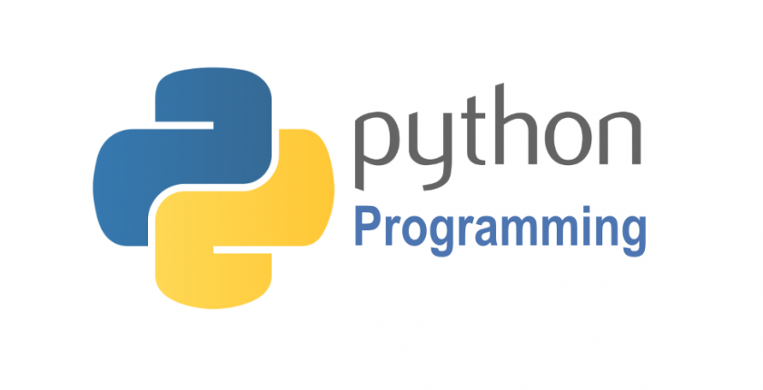
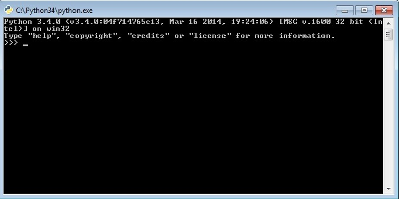

# Intro Python

## Qu'est-ce que Python? 
Python est un langage de programmation, dont la première version est sortie en 1991. Créé par      Guido van Rossum, il a voyagé du Macintosh de son créateur, qui travaillait à cette époque au      Centrum voor Wiskunde en Informatica aux Pays-Bas, jusqu'à se voir associer une organisation à     but non lucratif particulièrement dévouée, la Python Software Foundation, créée en 2001. Ce        langage a été baptisé ainsi en hommage à la troupe de comiques les « Monty Python ».

### Un langage de programmation interprété
 Python est un langage de programmation interprété, c'est-à-dire que les instructions que vous     lui envoyez sont « transcrites » en langage machine au fur et à mesure de leur lecture.
 D'autres langages (comme le C / C++) sont appelés « langages compilés » car, avant de pouvoir les exécuter, un logiciel spécialisé se charge de transformer le code du programme en langage machine. On appelle cette étape la « compilation ». À chaque modification du code, il faut rappeler une étape de compilation.

### À quoi peut servir Python ?
 *Python est un langage puissant, à la fois facile à apprendre et riche en possibilités.
 *Il est facile d'étendre les fonctionnalités existantes grâce à des bibliothèques.
 *Plusieurs bibliothèques peuvent ainsi être installées pour, par exemple, développer des interfaces graphiques en Python.
*Web : Aujourd'hui Python combiné avec le framework Django est un choix technologique très précis    pour les grands projets de sites web.
*Python est aussi fréquemment utilisé par les administrateurs système pour créer des tâches dites   répétitives ou simplement des tâches de maintenance.

## Le projet 
  *Nous allons essayer de faire un petit programme que nous appellerons BeCasino. Il s'agira d'un petit jeu de roulette très simplifié dans lequel vous pourrez miser une certaine somme et gagner ou perdre de l'argent :sob: ! Quand vous n'avez plus d'argent, vous avez perdu.
  * Voici les régles : 
     - Le joueur mise sur un numéro compris entre 0 et 36 (37 numéros en tout). En choisissant son numéro, il y dépose la somme qu'il souhaite miser.
     - Si le numéro gagnant est celui sur lequel le joueur a misé le croupier lui remet 36 fois la somme misée.
     - Sinon, le croupier regarde si le numéro misé par le joueur est de la même couleur que le  numéro gagnant (s'ils sont tous les deux pairs ou tous les deux impairs). Si c'est le cas, le croupier lui remet deux fois la somme misée. Sinon, le joueur perd sa mise.

## Lancer Python
    
### Sous windows

Vous avez plusieurs façons d'accéder à la ligne de commande Python, la plus évidente consistant à passer par les menus.

    Démarrer>Tous les programmes>Python 3.x>Python (Command Line).

### Sous Linux

Lorsque vous l'avez installé sur votre système, Python a créé un lien vers l'interpréteur sous la forme python3.X (le X étant le numéro de la version installée).

    Si, par exemple, vous avez installé Python 3.4, vous pouvez y accéder grâce à la commande :

## Premiers pas avec l'interpréteur de commandes Python

### Opération courante 

## Les variables 
En Python, pour donner une valeur à une variable, il suffit d'écrire. 

    nom_de_la_variable = valeur.

SI je veux associer mon nom à une variable la syntaxe sera donc :

### Première utilisation des fonctions
#### La fonction « type »
Permet de savoir de quel type est uen variable

#### La fonction print
 permet d'afficher n'importe quel nombre de valeurs fournies en arguments (c'est-à-dire entre les parenthèses). 
 

### Notre projet
Repassons maintenant à notre projet (Becasino), nous allons commencer par créer un dossier qu'on appellera "Becasino" , ensuite ouvrez ce dossier avec votre éditeur de texte , et créer y le fichier index.py
    Déclares y les variables de départ: 

- argent = Le montant qu'on a en arrivant à la roulette , on va dire 500
- continuer = True , reste vrai tant qu'on doit continuer la partie
- Rajouter une fonction qui nous indiquera notre somme de départ

 <a href="python2.md">NEXT >> </a>