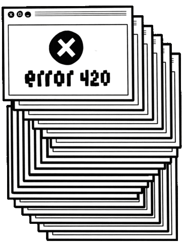

Vous devriez avoir quelque chose comme ceci:

``` py
argent=500
continuer= True
print ("Bienvenu à la roulette becasino vous démarrez avec",argent,"€")

```

## Les boucles 
### La boucle while 
Elle permet de répéter un bloc d'instructions tant qu'une condition est vraie.
``` py
a=8
i=0
    while i<a:
    print ('hello')
    i+=1
```
### La boucle for
La boucle for permet de faire des itérations sur un élément, comme une chaine de caractères par exemple ou une liste.
``` py
    texte="Python est trop cool"

    for lettre in texte:
        print(lettre)
```
### Retour à notre projet
Reprenons notre fichier becasi.py 
Nous allons maintenant pouvoir crée nos boucles 
 - Une premiere qui s'executera tant que notre variable 'continuer' est true 
 - Une deuxieme qui s'executera tant que l'utilisateur n'a pas rentrer un chiffre sur lequel parier.
 - Une troisiéme qui s'executera tant que l'utilisateur n'a pas rentrer une mise valable. 

 Ce qui donne quelque chose comme ça : 
``` py
argent=500
continuer= True

print ("Bienvenu à la roulette becasino vous démarrez avec",argent,"€")

while continuer:

    nombre = -1
    while nombre < 0 or nombre > 36:
        nombre = input("Tapez le nombre sur lequel vous voulez miser (entre 0 et 36) : ")
    

    while mise <= 0 or mise > argent:
        mise = input("Tapez le montant de votre mise : ")
    
``` 
## Gérez les exceptions
Si executé notre roulette grace à la commande suivante: 

    python3 becasi.py 

Vous pouvez constater qu'il nous retourne une erreur. 

   

En effet l'utilisateur entre une chaine de caractéres , nous allons devoir la convertire en entier. Pour cela nous allons utiliser le bloc try.

Nous allons en effet mettre les instructions que nous souhaitons tester dans un premier bloc et les instructions à exécuter en cas d'erreur dans un autre bloc.

On écrira ça comme ça : 
``` py
annee=input()
try:
    annee=int(annee)
except:
    print("Erreur lors de la conversion de l'année")
``` 
 Revenons donc maintenant à notre roulette et convertissons les données entrées en entier. 
 Si vous avez  bien fait ça vous devriez avoir ceci : 
``` py
while continuer:

    nombre = -1
    while nombre < 0 or nombre > 36:
        nombre = input("Tapez le nombre sur lequel vous voulez miser (entre 0 et 36) : ")
        try:
            nombre=int(nombre)
        except:
            print("Nombre invalide")
            nombre = -1 ##On réinitialise la variable pour recommencer la boucle
        
    mise = 0
    while mise <= 0 or mise > argent:
        mise = input("Tapez le montant de votre mise : ")
        try:
            mise=int(nombre)
        except:
            print("Nombre invalide")
            mise = -1  
```  
  

 <a href="python3.md">NEXT >> </a>